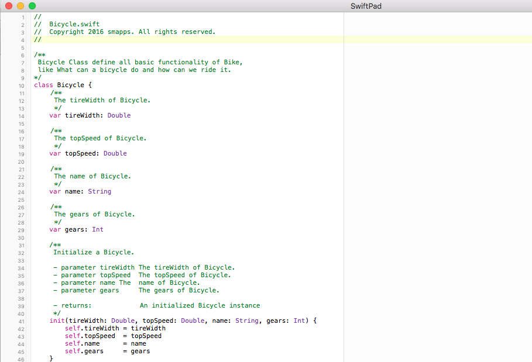

<h3 align="center">
    
     
  </a>
</h3>

# SwiftPad

SiwftPad is a simple Swift editor written in Swift. It uses [SourceKitten][sourcekitten] to support syntax highlighting.

[sourcekitten]: https://github.com/jpsim/SourceKitten

## Screenshot
Screenshot of the SwiftPad OS X app.

## Roadmap
- [x] Swift syntax highlighting.
- [ ] Swift code folding.
- [ ] Swift syntax Autocomplete.
- [ ] Multi-Document (Tab interface).
- [ ] Function List.
- [ ] Column Mode Editing
